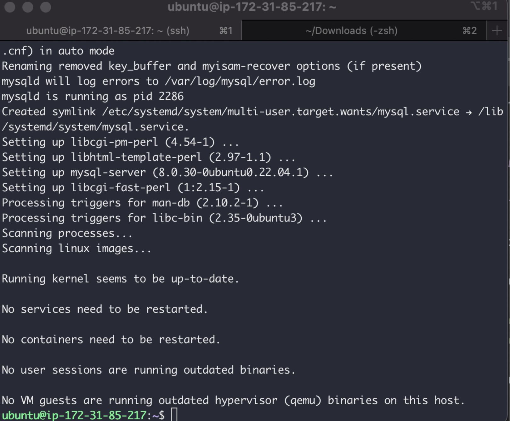
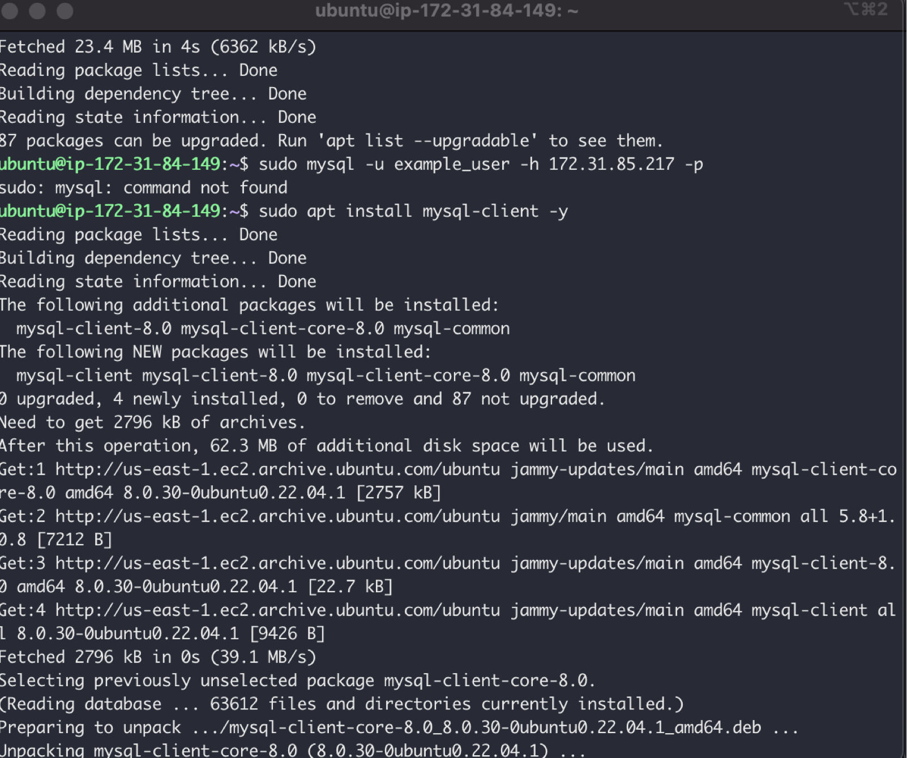
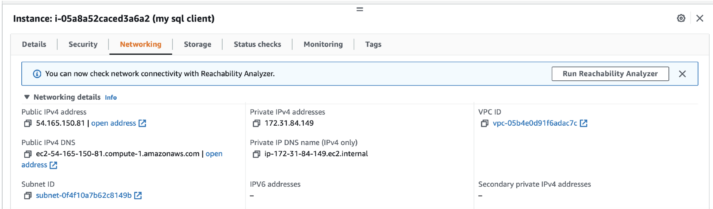
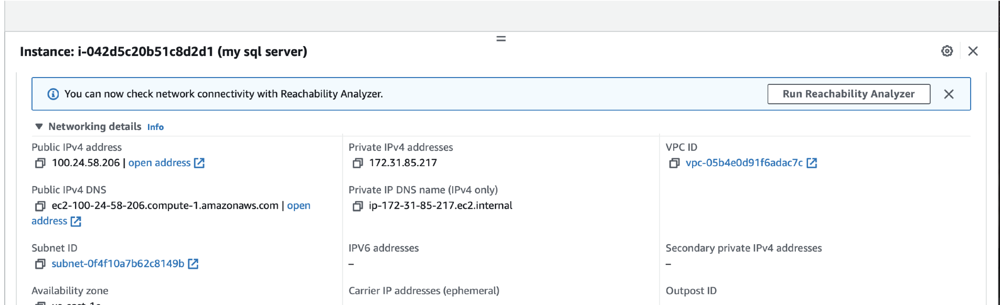
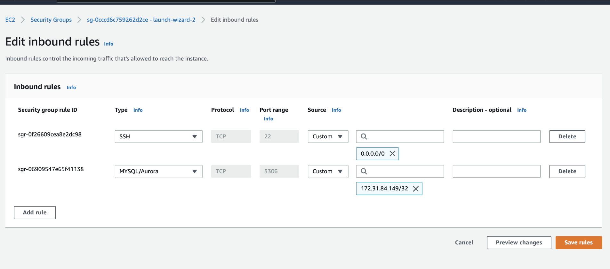
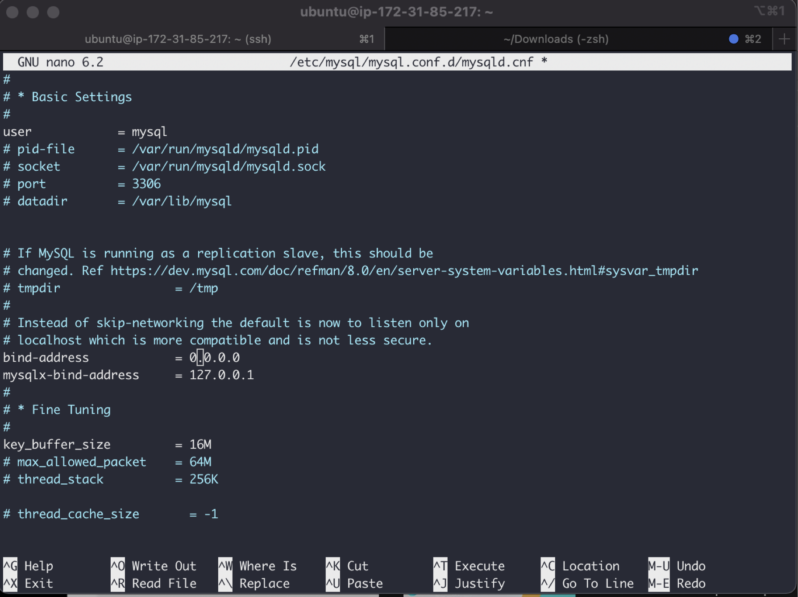
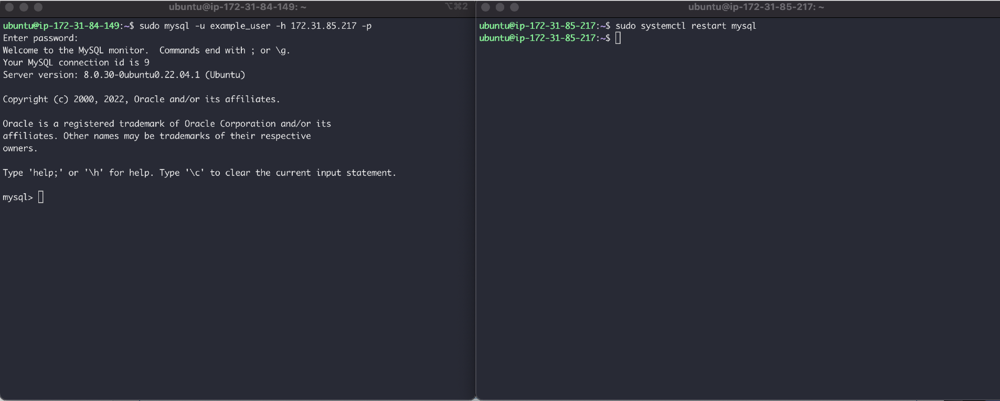
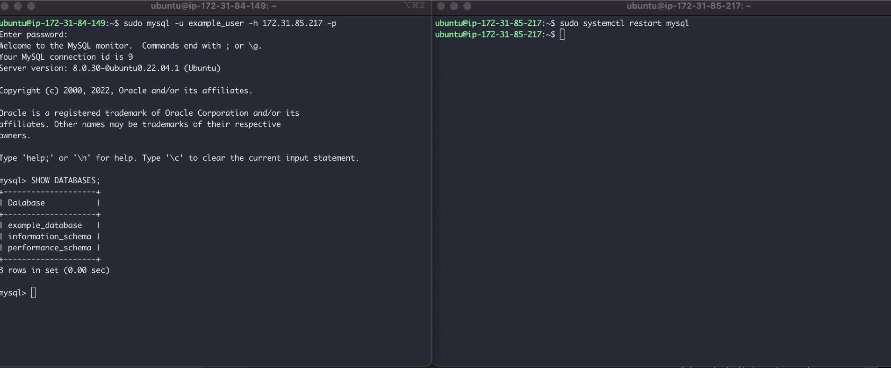

## CLIENT-SERVER ARCHITECTURE WITH MYSQL

### Understanding Client-Server Architecture

As you proceed your journey into the world of IT, you will begin to realise that certain concepts apply to many other areas. One of such concepts is – [Client-Server architecture.](https://en.wikipedia.org/wiki/Client–server_model)

Client-Server refers to an architecture in which two or more computers are connected together over a network to send and receive requests between one another.

In their communication, each machine has its own role: the machine sending requests is usually referred as "Client" and the machine responding (serving) is called "Server".

A simple diagram of Web Client-Server architecture is presented below:

In the example above, a machine that is trying to access a Web site using Web browser or simply ‘curl’ command is a client and it sends HTTP requests to a Web server (Apache, Nginx, IIS or any other) over the Internet.

If we extend this concept further and add a Database Server to our architecture, we can get this picture:

In this case, our Web Server has a role of a "Client" that connects and reads/writes to/from a Database (DB) Server (MySQL, MongoDB, Oracle, SQL Server or any other), and the communication between them happens over a Local Network (it can also be Internet connection, but it is a common practice to place Web Server and DB Server close to each other in local network).

The setup on the diagram above is a typical generic Web Stack architecture that you have already implemented in previous projects (LAMP, LEMP, MEAN, MERN), this architecture can be implemented with many other technologies – various Web and DB servers, from small Single-page applications [SPA](https://en.wikipedia.org/wiki/Single-page_application) to large and complex portals.

Real example of LAMP website

In Project 1 you implemented a LAMP STACK website, let us take an example of commercially deployed LAMP website – <mark>www.propitixhomes.com.</mark>

This LAMP website server(s) can be located anywhere in the world and you can reach it also from any part of the globe over global network – Internet.

Assuming that you go on your browser, and typed in there www.propitixhomes.com. It means that your browser is considered the "Client". Essentially, it is sending request to the remote server, and in turn, would be expecting some kind of response from the remote server.

Lets take a very quick example and see Client-Server communication in action.

Open up your Ubuntu or Windows terminal and run <mark>curl</mark> command:

`curl -Iv www.propitixhomes.com`

Note: If your Ubuntu does not have ‘curl’, you can install it by running <mark>sudo apt install curl</mark>

In this example, your terminal will be the client, while <mark>www.propitixhomes.com</mark> will be the server.

See the response from the remote server in below output. You can also see that the requests from the URL are being served by a computer with an IP address <mark>160.153.133.153</mark> on port <mark>80.</mark> More on IP addresses and ports when we get to Networking related projects

Another simple way to get a server’s IP address is to use a simple diagnostic tool like ‘ping’, it will also show round-trip time – time for packets to go to and back from the server, this tool uses [ICMP protocol.](https://en.wikipedia.org/wiki/Internet_Control_Message_Protocol)

### Side Self Study

Read about [ping](https://en.wikipedia.org/wiki/Ping_(networking_utility)) and [traceroute](https://en.wikipedia.org/wiki/Traceroute) network diagnostic utilities. Be able to make sense out of the results of using these tools.
Refresh your knowledge of [basic SQL commands,](https://www.w3schools.com/sql/) be able to perform simple SHOW, CREATE, DROP, SELECT and INSERT SQL queries.
Instructions On How To Submit Your Work For Review And Feedback
To submit your work for review and feedback – follow [this instruction.](https://www.darey.io/docs/how-to-submit-your-work-for-review-and-feedback-2/)

### IMPLEMENT A CLIENT SERVER ARCHITECTURE USING MYSQL DATABASE MANAGEMENT SYSTEM (DBMS).

#### TASK – Implement a Client Server Architecture using MySQL Database Management System (DBMS).

To demonstrate a basic client-server using MySQL Relational Database Management System (RDBMS), follow the below instructions

1. Create and configure two Linux-based virtual servers (EC2 instances in AWS).

Server A name - `mysql server`
Server B name - `mysql client`

2. On <mark>mysql server</mark> Linux Server install MySQL Server software.
   Interesting fact: MySQL is an open-source relational database management system. Its name is a combination of "My", the name of co-founder Michael Widenius’s daughter, and "SQL", the abbreviation for Structured Query Language.
   Now that you have a web server up and running, you need to install a Database Management System (DBMS) to be able to store and manage data for your site in a relational database. MySQL is a popular relational database management system used within PHP environments, so we will use it in our project.

Again, use ‘apt’ to acquire and install this software:

`sudo apt install mysql-server`

When prompted, confirm installation by typing Y, and then ENTER.

When the installation is finished, log in to the MySQL console by typing:

`sudo mysql`

This will connect to the MySQL server as the administrative database user root, which is inferred by the use of sudo when running this command. You should see output like this:

3. On mysql client Linux Server install MySQL Client software.

`sudo apt install mysql-client -y`

4. By default, both of your EC2 virtual servers are located in the same local virtual network, so they can communicate to each other using local IP addresses. Use mysql server's local IP address to connect from mysql client. MySQL server uses TCP port 3306 by default, so you will have to open it by creating a new entry in ‘Inbound rules’ in ‘mysql server’ Security Groups. For extra security, do not allow all IP addresses to reach your ‘mysql server’ – allow access only to the specific local IP address of your ‘mysql client’.

5. You might need to configure MySQL server to allow connections from remote hosts.

`sudo nano /etc/mysql/mysql.conf.d/mysqld.cnf`

Replace ‘127.0.0.1’ to ‘0.0.0.0’ like this:

6. From mysql client Linux Server connect remotely to mysql server Database Engine without using SSH. You must use the mysql utility to perform this action.

`sudo mysql -u "user" -h ip address of db server" -p`

`mysql> SHOW DATABASES;`

